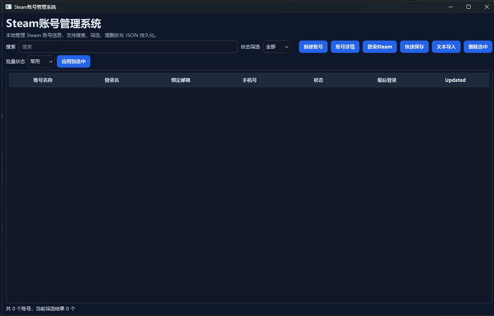

# Steam Account Manager

### [中文](README_zh.md) | [English](README.md)

Steam Account Manager is a local Windows desktop tool for managing multiple Steam account records and starting a Steam login attempt for the selected account.

The current UI is built with PySide6. The older Tkinter implementation is archived under `legacy/` for reference only; `main.py` starts only the PySide6 UI.



## Features

- Local account management with JSON persistence.
- User-defined account groups, group filtering, and batch group assignment.
- Search, status/group filtering, and sort selection with persisted list settings.
- Account sorting by recent use, 5E rank, or banned/frozen state.
- Required Steam login fields with optional 5E nickname and 5E rank fields shown directly in the account list.
- 5E season reset button: set every account to unranked and archive previous ranks in notes.
- Manual frozen-until time with approximate remaining-time display.
- Create, edit, delete, and batch-delete accounts.
- Batch status updates for selected accounts.
- Quick import for one-line or multi-line account text.
- Bulk text import with preview before saving.
- Duplicate import handling by `login_name`.
- Safer import overwrite behavior: empty imported fields do not wipe existing `last_login` or notes.
- Steam path auto-detection before manual selection.
- Login can be started from either the main account list or an existing account detail dialog.
- Last login time updates after a Steam login attempt starts successfully.
- Steam login panel with configurable shutdown behavior:
  - graceful shutdown first, ask before force close
  - force close directly
- Light/dark UI styling based on the Windows app theme.

## Requirements

- Windows
- Python 3.10+
- PySide6

Install dependencies:

```powershell
pip install -r requirements.txt
```

If you use Conda:

```powershell
conda activate py
python -m pip install -r requirements.txt
```

All verification commands in this repository are expected to run in the `py` Conda environment, for example:

```powershell
conda run -n py python -m unittest discover -s tests -v
```

## Run

```powershell
python main.py
```

`main.py` starts `qt_app.py`.

If PySide6 is not installed, the program will fail with an install hint. The archived Tkinter UI is not used by the entry point or release builds.

## Data Files

Runtime data is stored in the local `data/` directory:

```text
data/accounts.json
data/settings.json
```

These files are intentionally ignored by Git because they may contain account names, passwords, email addresses, phone numbers, Steam paths, and local settings.

`settings.json` also stores local UI preferences such as the account search text, status filter, group filter, sort order, Steam path, and login-notice settings.

## Import Format

The importer is designed for loosely structured account text containing labels such as:

- `5E账号`
- `5E密码`
- `昵称`
- `steam账号`
- `密码`
- `邮箱账号` / `油箱账号`
- `邮箱地址` / `油箱地址`
- `手机号`

One-account-per-line formats and multi-line account blocks are both supported.

Parsed 5E nicknames are stored in the dedicated `five_e_nickname` account field and shown as a separate column in the account list. Older data that still has a `5E昵称: ...` / `5E Nickname: ...` line in notes is still displayed through a fallback parser.

Steam login name and Steam password are the core required fields for an account. 5E information is optional and can be filled later.

## Security Notes

This tool is intended for local personal use and low-value secondary accounts.

Important tradeoffs:

- Account passwords are stored in local JSON as plain text.
- The Steam login attempt currently uses `steam.exe -login <login_name> <password>`.
- Command-line arguments may be visible to local diagnostic tools or other local processes.
- Do not commit, upload, or share `data/accounts.json`, `data/settings.json`, or raw import files such as `accounts.txt`.

If you need stronger security, add encrypted storage before using this with important accounts.

## Packaging

For a Windows executable, PyInstaller is the most practical option.

Recommended single-file build:

```powershell
pip install pyinstaller
python -m PyInstaller --noconfirm --clean --onefile --noconsole --name SteamAccountManager --icon imgs\gnuhl-7oo8y-001.ico --add-data "imgs\gnuhl-7oo8y-001.ico;imgs" --exclude-module tkinter --exclude-module legacy main.py
```

Build output:

```text
dist/
└─ SteamAccountManager.exe
```

Users can run `SteamAccountManager.exe` directly. On first launch, the app creates runtime data beside the executable:

```text
data/
├─ accounts.json
└─ settings.json
```

Keep real account data outside Git and avoid bundling real `accounts.json` or `settings.json` into distributable archives.

## Project Structure

```text
main.py              Entry point; starts the PySide6 UI
qt_app.py            Current PySide6 desktop UI
legacy/tk_app.py     Archived Tkinter UI reference; not used by main.py
models.py            SteamAccount data model
repositories.py      JSON load/save with validation and atomic writes
freeze_utils.py      Frozen-until time parsing and remaining-time formatting
text_importer.py     Account text parsing logic
system_utils.py      Windows/Steam helper functions
config.py            Paths, status definitions, translations, theme constants
steam_ui_probe.py    Helper script for investigating Steam login UI structure
data/                Local runtime data, ignored by Git
```

## Notes

This is a personal local utility, not an official Steam tool. Use it at your own risk.
